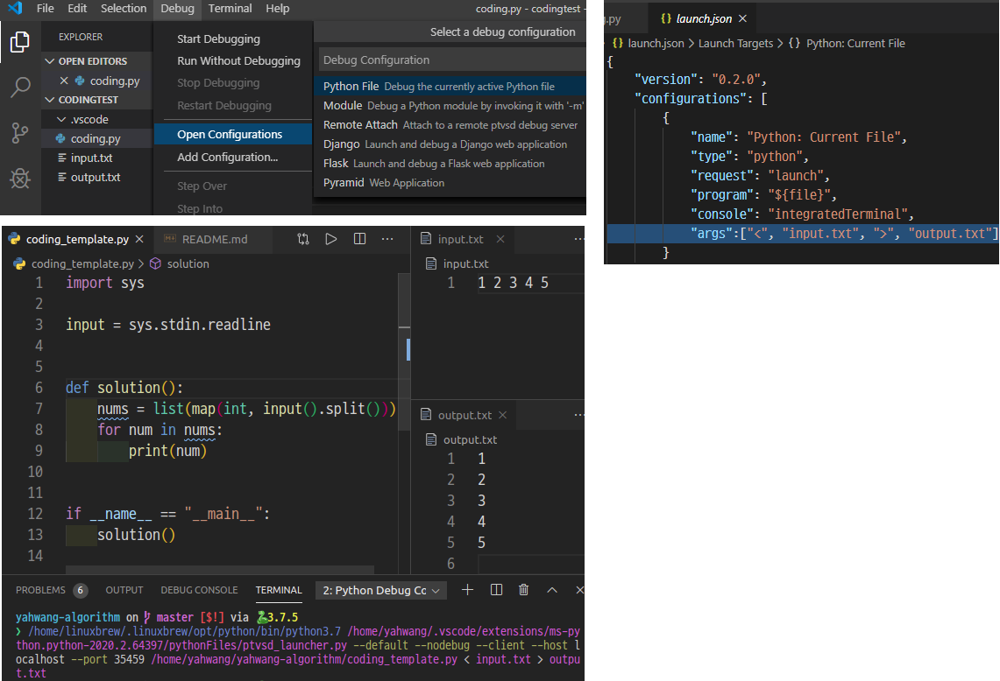

# yahwang-algorithm

## USER INFO

### [백준 알고리즘 - yahwang](https://www.acmicpc.net/user/yahwang)

### [CODESIGNAL - yahwang](https://app.codesignal.com/profile/yahwang/overview)

## VS code 세팅

input.txt를 읽어서 자동으로 output으로 print 결과를 내보내줌

화면처럼 args 설정을 추가해주면 된다. **Ctrl + F5**로 실행

